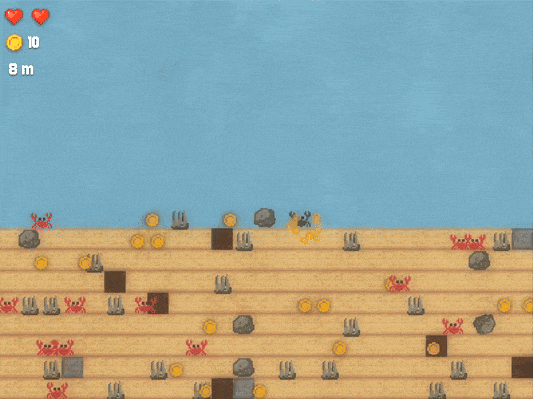
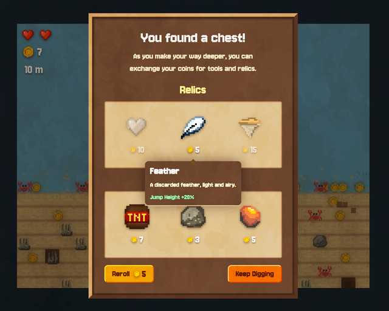
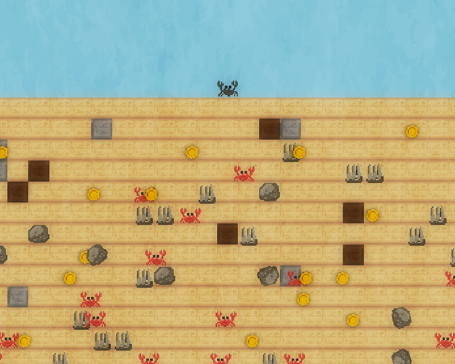
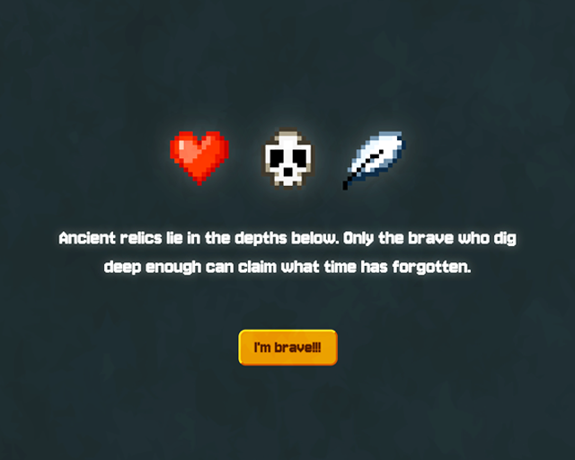

# Crabs in a Bucket

My solo compo submission for Ludum Dare 57, made in 48h. The theme was "Depths".

## Links

-   [Ludum Dare](https://ldjam.com/events/ludum-dare/57/crabs-in-a-bucket)
-   [Play Online](https://crabs-in-a-bucket.pages.dev/)

## Running it locally

```bash
bun install
bun run dev
```

## Screenshots






